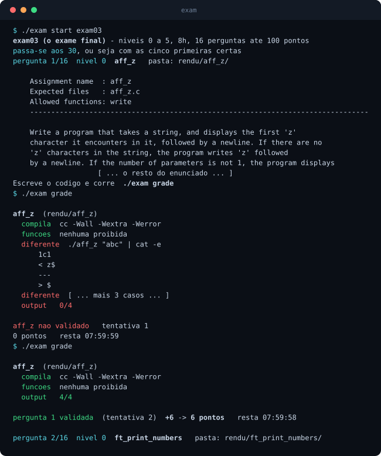
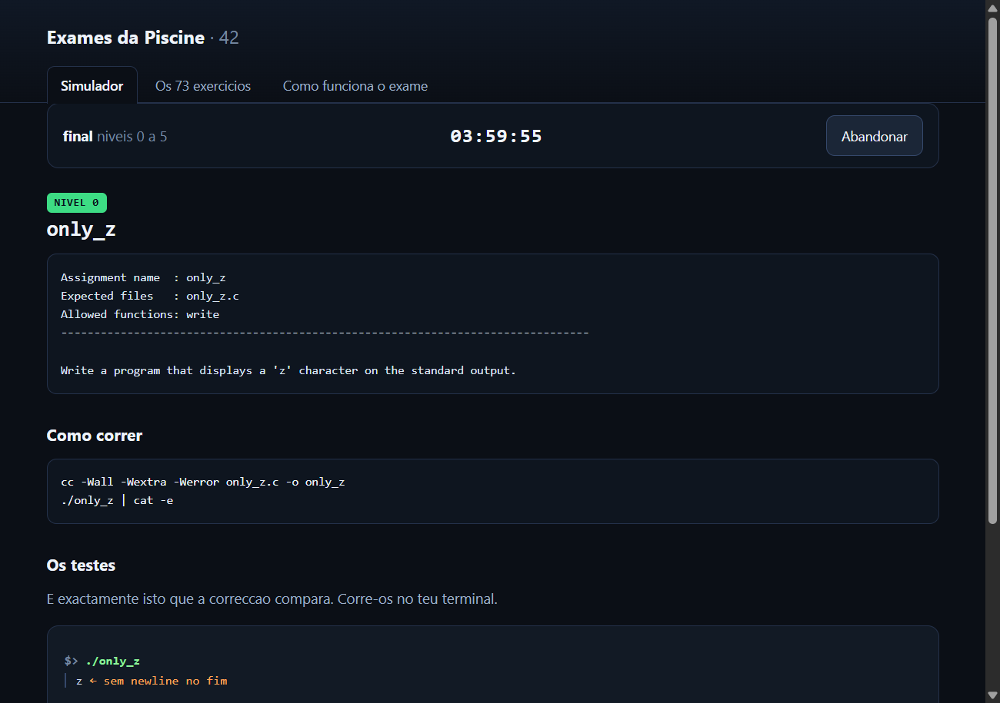

# 42 Piscine Exam Trainer

A working simulator for the four 42 Piscine exams — exam00, exam01, exam02, and
exam03, which is the final exam — plus the full exercise pool, tested reference
solutions, and a 111-page study document.

The command-line simulator does what the Moulinette does: it draws one exercise per
level starting at level 0, compiles your code with `cc -Wall -Wextra -Werror`, checks
for forbidden functions with `nm`, and diffs your output byte for byte.

**Web version (no install, no compiler):** https://tomascoutotech.github.io/42-piscine-exam-trainer/

> The written material is in Portuguese. The exercise statements are the original
> English ones, exactly as the exam shows them.



---

## Quick start

```sh
git clone https://github.com/tomascoutotech/42-piscine-exam-trainer
cd 42-piscine-exam-trainer
./exam start exam03
```

Needs Linux, macOS or WSL — same as the exam. It also runs on Windows without WSL,
under Git Bash: see [below](#windows-without-wsl). Then:

```
./exam grade            compile + forbidden functions + byte-for-byte diff
./exam status           level and time left
./exam solucao          reveal the solution (only after you have tried)
./exam treino ft_split  one exercise, no clock
./exam lista            the whole pool
./exam selftest         grades all 73 reference solutions (expects 73/73)
```

The Piscine has four exams and the last one, `exam03`, is the final exam. Levels:
`exam00` 0–1, `exam01` 0–2, `exam02` 0–3, `exam03` 0–5. It is also the default, so
plain `./exam start` gives you the final exam. Four hours by default
(`EXAM_TIME=7200 ./exam start exam01`).

## What a grade actually checks

```
cc -Wall -Wextra -Werror   no warnings at all, not one
nm                         no function outside "Allowed functions"
diff                       output identical, byte for byte
```

No norminette — the exam does not run it. A `for` loop or a 40-line function passes.
One extra newline does not.

The forbidden-function check runs on *your* object files only, compiled with
`-fno-builtin`. Without that flag gcc rewrites `printf("%c", c)` into `putchar` and
you get accused of calling a function you never wrote.

Two flags are added that the exam does not use, both to stop your toolchain from
failing you over something the school's would accept: `-fno-builtin` above, and
`-std=gnu17` on the compile. Without the second one, a gcc 15 reads the
`int (*cmp)()` that the `ft_list_remove_if` subject itself prescribes as "takes no
arguments" — a C23 rule — and refuses the code. The flags that decide your grade,
`-Wall -Wextra -Werror`, are the exam's.

## Windows without WSL

It runs under **Git Bash** (bundled with Git for Windows) as long as you have a C
compiler. MSYS2 is the easy one:

```sh
winget install MSYS2.MSYS2                     # once, in PowerShell
export PATH="$PATH:/c/msys64/ucrt64/bin"       # in Git Bash, before ./exam
./exam selftest
```

Measured: **72 of the 73** pass there. The simulator undoes two Windows artefacts by
itself — the `\n` → `\r\n` translation the MinGW runtime applies to program output,
and MSYS turning a `/` argument into a path like `C:/Program Files/Git`.

The one that fails is **`ft_itoa` with `INT_MIN`**, for a real reason: `long` is 32
bits on Windows, and the solution uses a `long` precisely to hold the `-2147483648`
that does not fit an `int`. On Linux, where the exam runs, `long` is 64 bits and it
works. The solution is not wrong; the same line of C means different things on the
two machines.

WSL is still the better way to practise — it is the system you will face in the exam.

## What is in here

```
exam                the simulator
pool/levelN/<name>/ the original subject.en.txt (+ examples.txt when it exists)
solucoes/<name>/    a reference solution, one folder per exercise
tests/cases/<name>/ the test cases: NN.cmd and the expected NN.out
tests/mains/        a main.c for each exercise that is a function, not a program
tests/include/      list.h and ft_list.h, the headers the evaluator provides
tools/gen.py        regenerates tests/cases and docs/data.js
docs/               the website and the PDF
```

73 exercises across levels 0–5. Every solution compiles with zero warnings and
passes all 189 test cases.

### The test cases are generated, never typed

No expected value in this repository was written by hand. `tools/gen.py` pulls the
commands out of the subject files (the lines starting with `$>`), runs them against
the reference solution, and stores what comes out. Then it compares that with the
output the subject displays. Three cases differ, all three explained in
[tools/diferencas.txt](tools/diferencas.txt) — two subject typos and one truncated
example. Any fourth difference means something broke.

To regenerate everything: `python3 tools/gen.py`.

## The website

[tomascoutotech.github.io/42-piscine-exam-trainer](https://tomascoutotech.github.io/42-piscine-exam-trainer/)
— draws exercises with a clock, lists all 73 with search, and shows the statement,
the test cases and the solution. It does not compile anything: browsers do not run C.



## The study document

[docs/exame-final-piscine.pdf](docs/exame-final-piscine.pdf) — 111 pages, in
Portuguese. All 70 final-exam exercises, each with what the subject asks for, how to
think about it, the code, and a line-by-line explanation of that code.

## Honest limits

- **This pool is reconstructed, not official.** It comes from public collections that
  agree with each other, cross-checked against real exam result files. It is good
  evidence. It is not the source of truth, and pools differ between campuses and years.
- **The solutions sit in the repository in plain sight.** The simulator will not show
  you one until you have attempted a grade, and the website asks first — but anyone
  can open `solucoes/` on GitHub. The gate is a speed bump for you, not a lock.
- **Copying in the real exam is detected and punished by 42.** This exists so you can
  practise under exam conditions and check your own work afterwards. It does not
  exist to be memorised.
- The website does not compile anything. Browsers do not run C. It shows the subject,
  the test cases and the solution; the grading lives in `./exam`.

## License

[MIT](LICENSE) for the simulator, the solutions, the tools and the document.

The exercise statements under `pool/` are not mine: they belong to 42 / École 42 and
are reproduced here for study.
